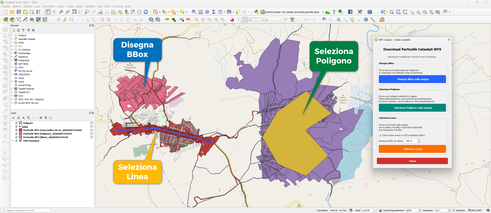
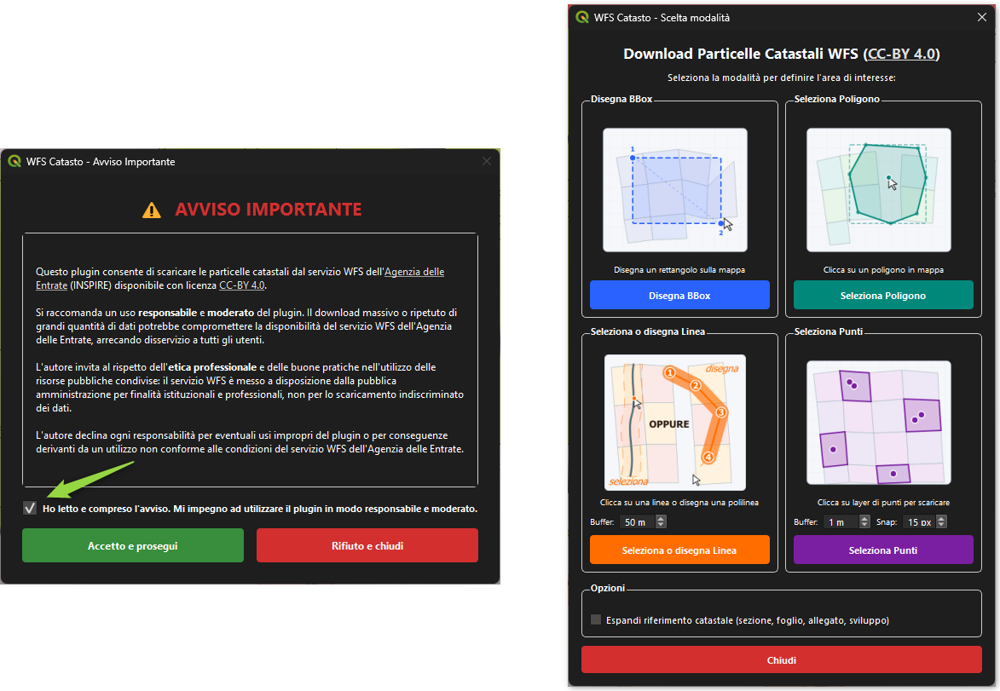

# WFS Catasto Download Particelle BBox

Plugin per QGIS che consente di scaricare le particelle catastali dal servizio WFS dell'[Agenzia delle Entrate](https://www.agenziaentrate.gov.it/portale/cartografia-catastale-wfs) (INSPIRE) disponibile con licenza [CC-BY 4.0](https://creativecommons.org/licenses/by/4.0/deed.it).



## Funzionalità

Quattro modalità di selezione dell'area di interesse:

1. **Disegna BBox** - Clicca due punti sulla mappa per disegnare un rettangolo che definisce l'area di download.
2. **Seleziona Poligono** - Clicca su un poligono esistente in mappa per estrarne automaticamente il bounding box. Se l'area è grande, viene suddivisa in tile automaticamente.
3. **Seleziona o disegna Linea** - Clicca su una linea esistente oppure disegna una polilinea direttamente sulla mappa (click sinistro per aggiungere vertici, click destro per terminare, ESC per annullare). Crea un buffer personalizzabile (0-100m) per scaricare le particelle che lo intersecano.
4. **Seleziona Punti** - Clicca su un layer di punti (o direttamente in mappa) per scaricare le particelle che contengono i punti. Supporta selezione parziale e auto-riproiezione UTM per CRS geografici.

### Funzione per il calcolatore di campi (v1.4.2)

Il plugin registra la funzione `get_particella_info($geometry)` nel gruppo **Catasto** del Field Calculator. Interroga il WFS e restituisce un array con:

| Indice | Contenuto |
|--------|-----------|
| `[0]` | NATIONALCADASTRALREFERENCE |
| `[1]` | Foglio |
| `[2]` | LABEL (numero particella) |
| `[3]` | Codice comune (ADMINISTRATIVEUNIT) |
| `[4]` | Geometria WKT |
| `[5]` | Sezione censuaria |
| `[6]` | Allegato |

### Opzione: Espandi riferimento catastale

Nella sezione **Opzioni** della finestra di scelta modalità è disponibile il checkbox **"Espandi riferimento catastale"**. Quando attivato, il plugin analizza il campo `NATIONALCADASTRALREFERENCE` e ne estrae 4 nuovi attributi nel layer di output:

| Campo | Tipo | Descrizione |
|-------|------|-------------|
| `sezione` | String | Sezione censuaria (lettera, es. A, B; vuoto se assente) |
| `foglio` | Integer | Numero del foglio catastale |
| `allegato` | String | Codice allegato (0 = nessuno, Q = quadro d'unione) |
| `sviluppo` | String | Codice sviluppo (0 = nessuno, U = quadro d'unione) |

Il parsing segue il formato ufficiale dell'Agenzia delle Entrate `CCCCZFFFFAS`, dove:
- **CCCC** = codice nazionale del comune (già presente nel campo `ADMINISTRATIVEUNIT`)
- **Z** = sezione censuaria (`_` se assente)
- **FFFF** = numero foglio (4 cifre, con zeri a sinistra)
- **A** = codice allegato
- **S** = codice sviluppo

Per ulteriori dettagli sulla codifica, consultare l'articolo di [Andrea Borruso](https://medium.com/tantotanto/le-mappa-castali-diventano-finalmente-utilizzabili-821db2f84533#9547).

### WMS Cartografia Catastale (v1.4.3)

Nella sezione **Opzioni** è disponibile il checkbox **"Carica WMS Cartografia Catastale"**. Quando attivato, il plugin:

- Aggiunge la connessione WMS dell'Agenzia delle Entrate al profilo QGIS (se non già presente)
- Carica un layer WMS combinato con 7 sublayer: province, mappe (CP.CadastralZoning), acque, strade, vestizioni, fabbricati, particelle (CP.CadastralParcel)
- Posiziona il layer in fondo al pannello Layer, sopra eventuali basemap XYZ (es. OpenStreetMap)

Il layer WMS viene caricato una sola volta per progetto (se già presente viene saltato).

### Stile automatico particelle (v1.4.4)

Il layer delle particelle viene caricato con uno **stile rule-based** automatico basato sul campo `LABEL`:

| Tipo | Colore | Regola |
|------|--------|--------|
| Particella (numero) | Arancione | Tutti i valori numerici (ELSE) |
| Strada | Grigio | `LABEL` contiene "STRADA" |
| Acqua | Blu | `LABEL` contiene "ACQUA" |

Il conteggio feature per categoria è visibile in legenda.

### Caratteristiche tecniche

- Download multi-tile con progress bar per aree estese
- Deduplicazione automatica delle feature
- Filtro spaziale per tutte le modalità
- Stile automatico rule-based (particelle/strade/acque) con conteggio in legenda
- Espansione opzionale del riferimento catastale nazionale
- Caricamento opzionale WMS Cartografia Catastale AdE
- GUI con illustrazioni SVG e griglia 2x2
- Versione plugin visualizzata nel titolo della finestra
- Tasto ESC per annullare qualsiasi modalità
- Compatibile con QGIS 3 (Qt5) e QGIS 4 (Qt6)

## Interfaccia

Al primo avvio per sessione QGIS viene mostrato un avviso obbligatorio sull'uso responsabile del plugin. Dopo l'accettazione si accede alla finestra di scelta modalità con griglia 2x2, che permette di navigare la mappa prima di selezionare la modalità.



## Installazione

### Da cartella plugin

1. Copia la cartella `wfs_catasto_download_particelle_bbox` nella directory dei plugin di QGIS:
   - **Windows**: `%APPDATA%\QGIS\QGIS3\profiles\default\python\plugins\`
   - **Linux**: `~/.local/share/QGIS/QGIS3/profiles/default/python/plugins/`
   - **macOS**: `~/Library/Application Support/QGIS/QGIS3/profiles/default/python/plugins/`
2. Riavvia QGIS.
3. Attiva il plugin dal menu **Plugin > Gestisci e installa plugin**.

### Da repository GitHub

```bash
cd <cartella_plugin_qgis>
git clone https://github.com/pigreco/wfs_catasto_download_particelle_bbox.git
```

## Avviso importante

Si raccomanda un uso **responsabile** e **moderato** del plugin. Il download massivo o ripetuto di grandi quantità di dati potrebbe compromettere la disponibilità del servizio WFS dell'Agenzia delle Entrate, arrecando disservizio a tutti gli utenti.

L'autore invita al rispetto dell'**etica professionale** e delle buone pratiche nell'utilizzo delle risorse pubbliche condivise: il servizio WFS è messo a disposizione dalla pubblica amministrazione per finalità istituzionali e professionali, non per lo scaricamento indiscriminato dei dati.

L'autore declina ogni responsabilità per eventuali usi impropri del plugin o per conseguenze derivanti da un utilizzo non conforme alle condizioni del servizio WFS dell'Agenzia delle Entrate.

## Changelog

- **1.4.11** - Fix logica "Seleziona Punti": separazione netta tra Sorgente=(clicca sulla mappa) [solo singola particella per click, sessione ESC] e Sorgente=layer [processing automatico senza click interattivi]; refactoring try/finally garantisce chiusura tool anche su errore; messaggio "Nessuna feature" migliorato con suggerimento per punti in mare
- **1.4.10** - Fix: combo "Sorgente" si azzera a "(clicca sulla mappa)" alla riapertura del dialogo; notifica nella barra messaggi QGIS con il conteggio feature caricate/aggiunte (sia per nuovo layer che per append)
- **1.4.9** - Modalità Seleziona Punti: nuova combo "Sorgente" per scegliere un layer di punti dal dialogo senza cliccare in mappa; nuova combo "Aggiungi a" per appendere le particelle a un layer Particelle WFS esistente (risolve issue [#6](https://github.com/pigreco/wfs_catasto_download_particelle_bbox/issues/6))
- **1.4.8** - Modalità Seleziona Punti: click singolo con accumulo feature nello stesso layer di sessione (append), deduplicazione cross-click, ESC affidabile con QShortcut
- **1.4.7** - Miglioramenti interfaccia: riorganizzato layout bottoni ("Chiudi" 3/4 spazio, "Guida" 1/4), aggiunta voce "Guida" nel menu Plugin
- **1.4.6** - Sistema help integrato con GitHub Pages (bottone "Aiuto" → documentazione online completa)
- **1.4.5** - Sottomenu nel menu Plugin con "Avvia Download Particelle Catastali" e "Informazioni", dialog AboutDialog completo con link GitHub e riferimenti WFS/WMS, fix compatibilità Qt5/Qt6
- **1.4.4** - Stile automatico rule-based per particelle (arancione), strade (grigio), acque (blu) con conteggio feature in legenda
- **1.4.3** - WMS Cartografia Catastale AdE (7 sublayer), connessione WMS auto nel profilo, posizionamento sopra basemap XYZ, versione plugin nel titolo GUI
- **1.4.2** - Funzione `get_particella_info($geometry)` per il calcolatore di campi
- **1.4.1** - Disegno polilinea nella modalità Linea, licenza CC-BY 4.0 cliccabile, link cliccabili nell'avviso, fix GUI in primo piano
- **1.4.0** - Nuova modalità Seleziona Punti, GUI griglia 2x2, tasto ESC
- **1.3.0** - Illustrazioni SVG nella GUI, icona SVG
- **1.2.0** - Ottimizzazione filtro spaziale modalità Poligono
- **1.1.0** - Espansione riferimento catastale (sezione, foglio, allegato, sviluppo)
- **1.0.0** - Prima release

## Licenza

Questo progetto è distribuito con licenza MIT.

## Ringraziamenti

Un sentito grazie ad [Andrea Borruso](https://github.com/aborruso) per l'idea e l'ispirazione.

---

> Questo repository è interamente creato con l'aiuto di [Claude Code](https://claude.ai/claude-code).

## Video Demo

[](https://youtu.be/iEFLlQq_9hY)

## Autore

**Salvatore Fiandaca** - [pigrecoinfinito@gmail.com](mailto:pigrecoinfinito@gmail.com)
